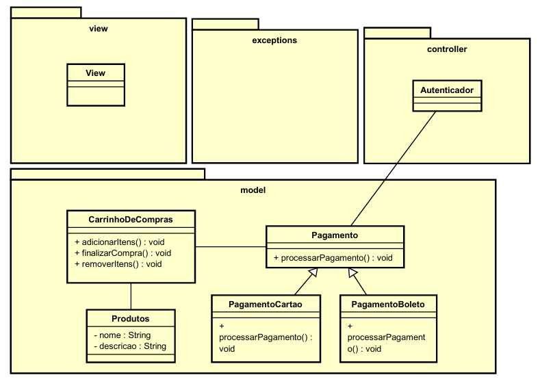

# loja-de-jogos
Uma loja de jogos eletronicos

<h2>Diagrama de classes</h2>

<h2>Requisitos</h2>

MENU DE PRODUTOS
CARRINHO
PAGAMENTO
PRODUTO

AO ENTRAR NO APP, O USUARIO IRÁ VISUALIZAR O MENU DE PRODUTOS.
O CLIENTE VAI PODER ADICIONAR PRODUTOS NO CARRINHO.
ELE VAI PODER VISUALIZAR O QUE TEM NO CARRINHO
ELE VAI PODER REMOVER O QUE TEM NO CARRINHO
ELE VAI PODER COMPRAR O QUTEM NO CARRNHO
	AO CLICAR EM COMPRAR, IRÁ SER DIRECIONADO AO MENU DE PAGAMENTO ONDE TERÁ QUE 
	ADICIONAR OS DADOS NECESSARIOS PARA EFETURAR A COMPRA. 
O SISTEMA IRÁ VERIFICAR SE OS DADOS SÃO CONFIRMADOS. SE TUDO DER CERTO, O PAGAMENTO SERÁ EFETUADO.
CASO O PAGAMENTO SEJA EFETUADO, IRÁ APARECER UMA TELA COM O COMPROVANTE E A OPCAO DE SAIR OU VOLTAR AO
MENU DE PRODUTOS.
